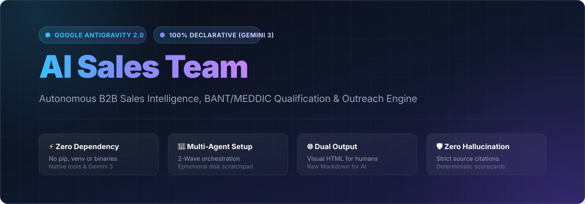

<p align="center">
  
</p>

# AI Sales Team — Antigravity Native

Système d'intelligence commerciale B2B déclaratif pour **Google Antigravity (Standalone / v2.0)**.
Conçu pour analyser des prospects, cartographier des comités d'achat, qualifier des opportunités et générer des stratégies d'outreach hyper-personnalisées sans aucune intervention manuelle de prospection réelle.

---

## 💡 Origine & Inspiration

Ce projet s'inspire du concept novateur développé par [Zubair Trabzada](https://github.com/zubair-trabzada) dans son projet [ai-sales-team-claude](https://github.com/zubair-trabzada/ai-sales-team-claude), initialement pensé pour l'écosystème Claude Code (Anthropic).

> [!NOTE]
> **Ré-architecture intégrale (ce projet n'est pas un fork de code) :**
> Ce dépôt est une refonte déclarative native complète pour **Google Antigravity (Standalone / v2.0)** orchestrée par **Gemini 3**.
> Il élimine l'ensemble des scripts Python, runtimes et dépendances externes au profit des compétences déclaratives (`skills.json`), d'une mémoire de session structurée (`.agents/.scratchpad/`), et d'une restitution en double livrable (Markdown brut pour les IA + HTML autonome stylisé pour les humains).

## ⚡ Zéro Dépendance (100 % Déclaratif)

Ce workspace ne requiert **aucun runtime Python, aucune installation `pip`, aucun environnement virtuel (`venv`) ni binaire externe**.

L'orchestration repose exclusivement sur les capacités natives du modèle Gemini 3 et les outils intégrés d'Antigravity :
- `read_url_content` : Navigation et scraping de pages statiques (sites officiels, mentions légales, blogs, pages tarifs).
- `search_web` : Intelligence externe en temps réel (actualités, levées de fonds, recrutements, avis clients, signaux LinkedIn).
- `create_file` & `edit_file` : Génération des livrables Markdown/HTML et persistance de données de session.
- `start_subagent` : Délégation asynchrone aux sous-agents d'audit spécialisés.
- `view_file` : Chargement à la demande des contextes et références.

---

## 📦 Guide d'Installation & Démarrage (Pour les Profils Non-Tech)

Ce projet est immédiatement opérationnel. Vous n'avez pas besoin de savoir coder, ni d'ouvrir un terminal technique.

### Étape 1 : Installer Google Antigravity
1. Rendez-vous sur le site officiel de [Google Antigravity](https://antigravity.google) (ou téléchargez l'application **Antigravity 2.0** pour macOS / Windows / Linux).
2. Installez l'application et connectez-vous avec votre compte Google.

### Étape 2 : Récupérer le Projet
Deux manières simples selon vos préférences :
- **Option A (Via l'interface Antigravity) :**
  Ouvrez Antigravity, cliquez sur **"Open Folder"** (ou **"Clone Repository"**) et sélectionnez le dossier `sales-agents-agy`.
- **Option B (En ligne de commande classique si vous utilisez Git) :**
  ```bash
  git clone https://github.com/votre-compte/sales-agents-agy.git
  cd sales-agents-agy
  agy
  ```

> [!TIP]
> **Rappel Zéro-Tech :** Aucun `npm install`, aucun `pip install`, aucun script d'installation à lancer. Dès que le dossier est ouvert dans Antigravity, tous les agents sont prêts.

### Étape 3 : Configurer votre Offre Commerciale (2 minutes)
Pour que les agents vendent *votre* solution et pas des offres imaginaires :
1. Ouvrez le fichier [`.agents/rules/product-context.md`](.agents/rules/product-context.md) directement dans Antigravity.
2. Renseignez vos forfaits, tarifs officiels et cibles.
3. *Astuce :* Vous pouvez simplement demander à l'agent dans le chat :
   > *"Voici mon offre : [copier votre texte de vente]. Mets à jour le fichier product-context.md pour moi."*

### Étape 4 : Lancer votre Premier Audit !
Dans le chat Antigravity, tapez simplement :
```text
prospect https://nom-du-prospect.com
```
L'équipe d'agents s'active automatiquement, réalise l'audit en coulisses et vous délivre vos deux rapports (Markdown + Web interactif).

---

## 🏛️ Gouvernance & Règles Transversales

Le comportement du système est encadré de façon déterministe par des règles Markdown strictes découvertes automatiquement par le runtime Antigravity :

```
sales-agents-agy/
├── AGENTS.md                    ← Point d'entrée session (principes cardinaux, routing, dépendances)
└── .agents/
    ├── skills.json              ← Registre de découverte des 18 compétences actives
    ├── .scratchpad/             ← Espace mémoire tampon inter-agents (gitignored)
    └── rules/                   ← Règles transversales modulaires
        ├── product-context.md   ← Source de vérité de l'offre vendue (prix, fonctionnalités, limites)
        ├── fact-checking.md     ← Protocole web strict (zéro hallucination, fraîcheur, sources citées)
        ├── scoring.md           ← Barèmes déterministes BANT (0-100) + MEDDIC (%) + Prospect Score
        └── output-formatting.md ← Double livrable (MD + HTML) et convention reports/{slug}/
```

### Principes Non-Négociables
1. **Zéro Hallucination :** Données publiquement vérifiées uniquement. Toute donnée absente est notée `Non disponible publiquement`.
2. **Passivité Absolue :** Le système n'envoie aucun email ni message sortant. Tous les livrables sont des brouillons destinés à la revue humaine.
3. **Scoring Déterministe :** Application stricte des barèmes de `scoring.md` sans extrapolation optimiste.
4. **Contexte Produit Strict :** Alignement absolu avec `.agents/rules/product-context.md`.

---

## 🧩 Architecture des Compétences (13 Skills + 5 Sous-Agents)

Le registre regroupe **18 compétences actives**, optimisées sous un budget strict (< 90 lignes par `SKILL.md`) avec déport des volumineux templates et matrices dans des sous-dossiers `references/` chargés à la demande.

### Compétences Utilisateur (13)
- **`sales`** : Orchestrateur principal et aiguillage de la CLI.
- **`sales-qualify`** : Qualification BANT et complétude MEDDIC.
- **`sales-research`** : Analyse firmographique approfondie sur 8 dimensions.
- **`sales-contacts`** : Cartographie du comité d'achat (décideurs, champions, gatekeepers).
- **`sales-prospect`** : Audit 360° complet avec calcul du Prospect Score (0-100).
- **`sales-outreach`** : Génération de séquence d'outreach cold omnicanal (5 touches).
- **`sales-followup`** : Séquences de relance multi-scénarios (silence, objections, stagnation).
- **`sales-prep`** : Brief de réunion commerciale en 10 sections clés.
- **`sales-proposal`** : Rédaction de proposition commerciale complète et chiffrée.
- **`sales-objections`** : Playbook interactif de traitement d'objections (méthode A-R-C).
- **`sales-icp`** : Modélisation du profil client idéal et scoring associé.
- **`sales-competitors`** : Détection de tech stack, switching costs et Battle Cards.
- **`sales-report`** : Consolidation du statut global du pipeline commercial.

### Sous-Agents Internes (`sales-sub-*`)
Composants spécialisés exécutés exclusivement par l'orchestrateur `sales-prospect` :
- `sales-sub-company` : Firmographics, signaux financiers et tech stack.
- `sales-sub-contacts` : Identification des décideurs et patterns d'e-mails.
- `sales-sub-competitive` : Analyse de l'écosystème d'outils et opportunités de déplacement.
- `sales-sub-opportunity` : Scoring déterministe BANT + MEDDIC.
- `sales-sub-strategy` : Choix du canal optimal, angles d'accroche et déclencheurs.

---

## 🔄 Workflow `prospect <url>` (2 Vagues & Scratchpad)

L'audit complet d'un prospect s'exécute en **2 vagues séquentielles** coordonnées via un fichier d'échange structuré sur disque : `.agents/.scratchpad/prospect_{slug}.json`.

```
                        prospect <url>
                              │
             [sales-prospect initialise le scratchpad]
                              │
       ┌──────────────────────┴──────────────────────┐
       │     VAGUE 1 : Recherche Indépendante        │
       │                                             │
       │  1. sales-sub-company                       │
       │  2. sales-sub-contacts                      │
       │  3. sales-sub-competitive                   │
       └──────────────────────┬──────────────────────┘
                              │
                [status = "wave1_complete"]
                              │
       ┌──────────────────────┴──────────────────────┐
       │     VAGUE 2 : Synthèse & Stratégie          │
       │                                             │
       │  4. sales-sub-opportunity (BANT / MEDDIC)   │
       │  5. sales-sub-strategy (Outreach & Angles)  │
       └──────────────────────┬──────────────────────┘
                              │
                [status = "wave2_complete"]
                              │
                              ▼
            reports/{slug}/PROSPECT-ANALYSIS.md
            reports/{slug}/PROSPECT-ANALYSIS.html
```

Ce pattern prévient la saturation du contexte mémoire (*attention dilution*) tout en assurant une traçabilité complète des données intermédiaires.

---

## 📁 Stockage des Livrables : HTML pour Humains & Markdown pour IA

Chaque analyse produit deux formats avec une séparation claire des usages :
1. **Version Visuelle (Pour les Humains) :** Fichiers `.html` enregistrés directement sous `reports/{slug}/`. Rendu visuel soigné avec cartes, jauges SVG inline, tags et mise en page optimisée pour l'impression A4 / export PDF.
2. **Version Données Brutes (Pour les IA) :** Fichiers `.md` rangés dans le sous-dossier `reports/{slug}/markdown/` pour faciliter leur réutilisation directe par des modèles ou agents ultérieurs.
3. **Portail Centralisé :** `reports/index.html` lie et référence l'intégralité des rapports générés dans une interface unifiée.

```text
reports/
├── .gitkeep
├── index.html                                   ← Portail interactif global (Dashboard)
├── PIPELINE-SUMMARY.html                        ← Rapport pipeline global (Web)
├── markdown/
│   └── PIPELINE-SUMMARY.md                      ← Rapport pipeline global (IA)
└── {slug}/                                      ← Dossier dédié par entreprise analysée
    ├── PROSPECT-ANALYSIS.html                   ← Audit visuel (Humains)
    ├── OUTREACH-SEQUENCE.html                   ← Séquence visuelle (Humains)
    ├── MEETING-PREP.html                        ← Brief réunion visuel (Humains)
    └── markdown/                                ← Données brutes réutilisables (IA)
        ├── PROSPECT-ANALYSIS.md
        ├── OUTREACH-SEQUENCE.md
        └── MEETING-PREP.md
```

---

## 🚀 Répertoire des Commandes

| Commande | Action | Livrables générés (Markdown + HTML) |
|---|---|---|
| `prospect <url>` | Audit 360° complet en 2 vagues | `reports/{slug}/PROSPECT-ANALYSIS.md` & `.html` |
| `qualify <url>` | Qualification BANT/MEDDIC rapide | `reports/{slug}/LEAD-QUALIFICATION.md` & `.html` |
| `research <url>` | Analyse firmographique détaillée | `reports/{slug}/COMPANY-RESEARCH.md` & `.html` |
| `contacts <url>` | Cartographie du comité d'achat | `reports/{slug}/DECISION-MAKERS.md` & `.html` |
| `outreach <prospect>` | Séquence de prospection 5 touches | `reports/{slug}/OUTREACH-SEQUENCE.md` & `.html` |
| `followup <prospect>` | Séquence de relance ciblée | `reports/{slug}/FOLLOWUP-SEQUENCE.md` & `.html` |
| `prep <url>` | Brief de préparation de réunion | `reports/{slug}/MEETING-PREP.md` & `.html` |
| `proposal <client>` | Proposition commerciale complète | `reports/{slug}/CLIENT-PROPOSAL.md` & `.html` |
| `competitors <url>` | Détection de stack & Battle Cards | `reports/{slug}/COMPETITIVE-INTEL.md` & `.html` |
| `icp <description>` | Construction du persona & scoring ICP | `reports/IDEAL-CUSTOMER-PROFILE.md` & `.html` |
| `objections <topic>` | Playbook de réponses aux objections | `reports/OBJECTION-PLAYBOOK.md` & `.html` |
| `report` | Synthèse globale du pipeline | `reports/PIPELINE-SUMMARY.md` & `.html` |

---

## 📜 Licence

Ce projet est distribué sous licence MIT. Consulter le fichier [LICENSE](LICENSE) pour plus de détails.
